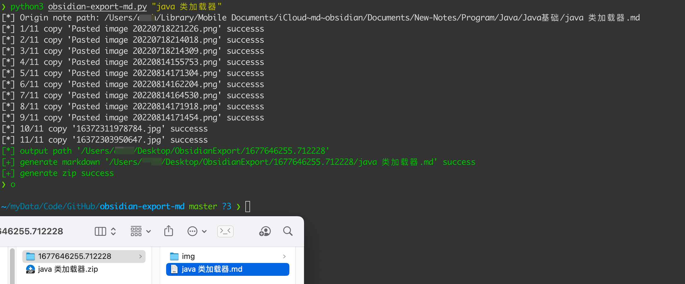

## 简介
没有找到趁手的obsidian导出插件，所以简单搞了个导出md标准格式的小脚本。

通过正则把obsidian的wiki格式转为可被typora识别的格式

导出后可以使用typora打开

## 用法

1. 首先修改脚本中的自己笔记仓库位置、图片存放位置（推荐把所有图片存放在一个文件夹内）

2. 直接运行脚本，参数为你的笔记名
将会自动导出md，以及md中的所有图片，并自动打zip包

```bash
python3 obsidian-export-md.py "java 类加载器"
```



